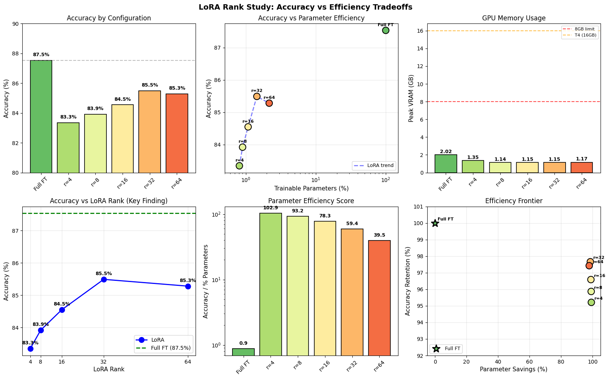

# Optimizing Financial Sentiment Analysis: A Systematic Study of LoRA Rank Selection

**Author:** ValtricAI Research
**Date:** December 2025
**Status:** Technical Report (LaTeX version: `paper.tex`)

---

## Abstract

We present a systematic investigation of Low-Rank Adaptation (LoRA) rank selection for financial sentiment analysis. Using DistilRoBERTa-base (82M parameters) on the Twitter Financial News Sentiment dataset, we evaluate six configurations: full fine-tuning and LoRA at ranks 4, 8, 16, 32, and 64. Our key finding is that **rank-32 achieves optimal accuracy (85.5%)**, outperforming rank-64 (85.3%) while using 25% fewer trainable parameters. All LoRA configurations reduce peak GPU memory by 40-44% compared to full fine-tuning.

---

## Key Finding

**LoRA r=32 outperforms r=64** — This challenges the assumption that higher ranks yield better performance.

| Rank | Accuracy | Insight |
|------|----------|---------|
| r=32 | **85.54%** | Best LoRA accuracy |
| r=64 | 85.28% | 0.26pp worse than r=32 |

---

## Complete Results

| Configuration | Params (%) | Accuracy | F1 Score | VRAM (GB) | Time (s) |
|---------------|------------|----------|----------|-----------|----------|
| Full Fine-Tuning | 100.00% | **87.53%** | **87.63%** | 2.02 | 31.1 |
| LoRA r=4 | 0.81% | 83.33% | 83.33% | 1.35 | 27.9 |
| LoRA r=8 | 0.90% | 83.93% | 83.90% | **1.14** | 27.5 |
| LoRA r=16 | 1.08% | 84.52% | 84.48% | 1.15 | 27.6 |
| LoRA r=32 | 1.44% | 85.54% | 85.50% | 1.15 | 27.7 |
| LoRA r=64 | 2.16% | 85.28% | 85.47% | 1.17 | 27.8 |

---

## Efficiency Analysis

| Config | Accuracy Retention | Param Reduction | VRAM Savings |
|--------|-------------------|-----------------|--------------|
| LoRA r=4 | 95.2% | 99.2% | 33.2% |
| LoRA r=8 | 95.9% | 99.1% | 43.6% |
| LoRA r=16 | 96.6% | 98.9% | 43.1% |
| LoRA r=32 | **97.7%** | 98.6% | 43.1% |
| LoRA r=64 | 97.4% | 97.8% | 42.1% |

---

## Visualizations

**Figure 1:** Six-panel analysis showing:
- (a) Accuracy by configuration
- (b) Accuracy vs parameters (log scale)
- (c) GPU memory usage
- (d) **Accuracy vs LoRA Rank** — the key finding showing non-monotonic relationship
- (e) Parameter efficiency score
- (f) Efficiency frontier

---

## Deployment Recommendations

| Use Case | Recommendation |
|----------|----------------|
| Maximum accuracy required | Full Fine-Tuning |
| Production deployment | **LoRA r=32** |
| Multi-adapter serving | LoRA r=16 or r=32 |
| Consumer hardware (< 4GB VRAM) | LoRA r=8 |
| Rapid experimentation | LoRA r=4 |

---

## Methodology

**Dataset:** Twitter Financial News Sentiment (9,543 samples)
- Train: 7,634 | Test: 1,909
- Labels: Bearish, Bullish, Neutral

**Model:** DistilRoBERTa-base (82M parameters)

**LoRA Configuration:**
- Target modules: `query`, `value`
- Alpha: 2 × rank
- Dropout: 0.1

**Training:**
- Batch size: 32
- Learning rate: 2e-5 (full), 1e-4 (LoRA)
- Epochs: 3
- Precision: FP16

---

## References

1. Hu, E., et al. (2021). LoRA: Low-Rank Adaptation of Large Language Models. *ICLR 2022*. [arXiv:2106.09685](https://arxiv.org/abs/2106.09685)

2. Gao, C., & Zhang, S.Q. (2024). DLoRA: Distributed Parameter-Efficient Fine-Tuning Solution for Large Language Model. *EMNLP Findings 2024*. [ACL Anthology](https://aclanthology.org/2024.findings-emnlp.802/)

3. Zhao, J., et al. (2024). LoRA Land: 310 Fine-tuned LLMs that Rival GPT-4. *arXiv:2405.00732*. [arXiv](https://arxiv.org/abs/2405.00732)

4. Araci, D. (2019). FinBERT: Financial Sentiment Analysis with BERT. [GitHub](https://github.com/ProsusAI/finBERT)

5. Sakana AI. (2025). Evolutionary Optimization of Model Merging Recipes. *Nature Machine Intelligence*. [sakana.ai](https://sakana.ai/evolutionary-model-merge/)

---

## Files

| File | Description |
|------|-------------|
| `paper.tex` | LaTeX research paper (compile with pdflatex) |
| `lora_experiment_colab.ipynb` | Jupyter notebook with all experiments |
| `experiment_results.json` | Raw experimental data |
| `output.png` | 6-panel visualization |
| `LITERATURE_REVIEW.md` | Comprehensive literature review |

---

*ValtricAI Research — December 2025*
